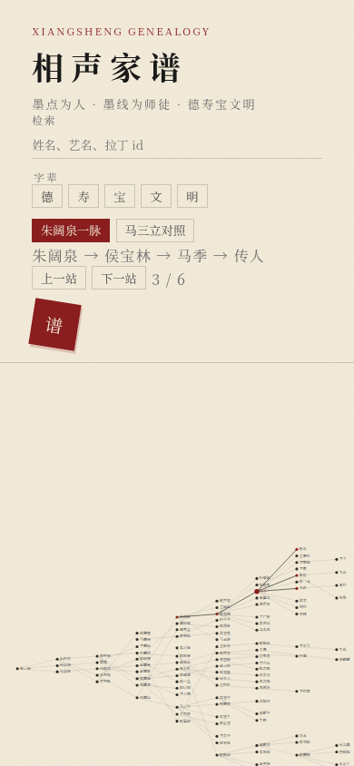

<p align="center"><a href="README.md">中文</a> | English</p>

<div align="center">
  
  <h1>Xiangsheng Genealogy（相声家谱）</h1>
  <p><strong>Open-source ink-wash 3D map of cited Chinese crosstalk lineages</strong></p>
  <p>
    
    
    
    
    
  </p>
</div>

---

## One-line brief

**Xiangsheng Genealogy（相声家谱） is an open-source ink-wash 3D map of Chinese crosstalk (相声, xiangsheng) master–disciple lineages: who taught whom, which generation name they carried, and where that claim is written down. People are ink dots; mentor→disciple links are ink strokes.**

> Generation characters are **德寿宝文明** only (德 / 寿 / 宝 / 文 / 明) — not 「德寿喜哈」. This repo does not host audio. Portraits are placeholder seals, public-domain files, or external URLs.

## Screenshots

<div align="center">
  
  <p><em>Desktop — default tour, 朱阔泉 selected, 3D ink graph + person panel</em></p>
  
  <p><em>Narrow viewport — paper / SVG fallback</em></p>
</div>

More captures: [docs/README.md](docs/README.md).

## Features

| Area | What it does |
| --- | --- |
| **3D lineage graph** | Ink nodes for people, ink strokes for mentor→disciple; camera fly-to on select |
| **Person panel** | Bio, 字辈, **work titles**, sources — no playback, no audio downloads |
| **Default path** | 朱阔泉 → 侯宝林 → 马季 → disciples |
| **Contrast path** | Optional 马三立 line |
| **Search + filters** | Name / stage name / id; 德 / 寿 / 宝 / 文 / 明 |
| **Mobile** | Paper SVG fallback on narrow viewports |
| **Deep links** | `/p/:id` |
| **Open data** | `data/people/*.json`, `data/edges.json`, `data/sources.json`, `data/events.json`, and JSON Schema |

The UI also has scroll, tree, book, and timeline browse views. GPU visual QA is still environment-limited; a merge is not design-comp sign-off. Later stages: [development roadmap](docs/next-development-roadmap.md).

## Stack

```
┌──────────────────────────────────────────────────────────────┐
│  App (Vite)                                                  │
│  ├── React 19 + TypeScript                                   │
│  ├── React Three Fiber + Drei + Three.js                     │
│  ├── GSAP                                                    │
│  ├── react-router-dom (deep links /p/:id)                    │
│  ├── Phosphor icons                                          │
│  └── Fonts: Noto Serif SC / Ma Shan Zheng                    │
├──────────────────────────────────────────────────────────────┤
│  Data                                                        │
│  └── data/people · edges.json · sources.json · events.json   │
└──────────────────────────────────────────────────────────────┘
```

UI: xuan paper `#F3EBD9`, ink greys, cinnabar seal `#8B1E1E`.

## Quick start

Node.js and npm are required. CI uses Node 22.

```bash
git clone https://github.com/jammyfu/xiangsheng-genealogy.git
cd xiangsheng-genealogy
npm install
npm test          # vitest
npm run dev
```

Production build:

```bash
npm run build
npm run preview
```

## Data

Current catalog (counts move with commits): **119** person JSON files under `data/people/`, plus 105 mentor edges, 25 sources, and 11 formal events. These numbers are inclusion counts, not a claim of full verification or a complete roster. See [data coverage](docs/data-coverage.md).

| Kind | Path |
| --- | --- |
| People | `data/people/*.json` |
| Edges | `data/edges.json` |
| Sources | `data/sources.json` |
| Life events | `data/events.json` |
| Schemas | `data/schemas/` |

Files under `data/` are the maintained catalog and the app’s source of truth. Update those files when correcting a person or relationship, adding a source, or recording a life event. Keep each claim tied to its sources; use named, sourced perspectives for attributed or disputed accounts. Record organization departures, expulsions, and performance suspensions as distinct events without deleting historical teacher links.

Validate catalog changes before committing:

```bash
npm test
npm run build
```

Every person cites at least one source. Unsettled teacher links are `"disputed": true`. Generation characters are only 德 / 寿 / 宝 / 文 / 明; generations 1–3 and 9+ may be `null`. Works are titles only.

The original seed is a historical reference fixture. It lacks later corrections and must not replace the maintained catalog. The exporter writes `people/` and `edges.json` into a new system temporary directory and prints its location:

```bash
node scripts/emit-seed.mjs
```

To choose the export location, provide a new directory outside `data/` whose parent already exists:

```bash
node scripts/emit-seed.mjs --out /tmp/xiangsheng-seed-review
```

The script refuses existing output directories and destinations inside `data/`, including paths through symlinks. It never regenerates or clears the curated catalog. Review historical exports separately; apply source-checked corrections to the maintained files individually.

## License

- Source code: [MIT](LICENSE)
- Dataset notices: [NOTICE](NOTICE), [ATTRIBUTION.md](ATTRIBUTION.md)
- Wikipedia-derived tables remain [CC BY-SA 4.0](https://creativecommons.org/licenses/by-sa/4.0/)

## Contributing

See [CONTRIBUTING.md](CONTRIBUTING.md). Machine-readable summary: [llms.txt](llms.txt). Chinese README (default): [README.md](README.md).

This is a research visualization, not a court of seniority. Prefer published tables over gossip.

---

<div align="center">
  <sub>Xiangsheng Genealogy · 相声家谱 · MIT</sub>
</div>
