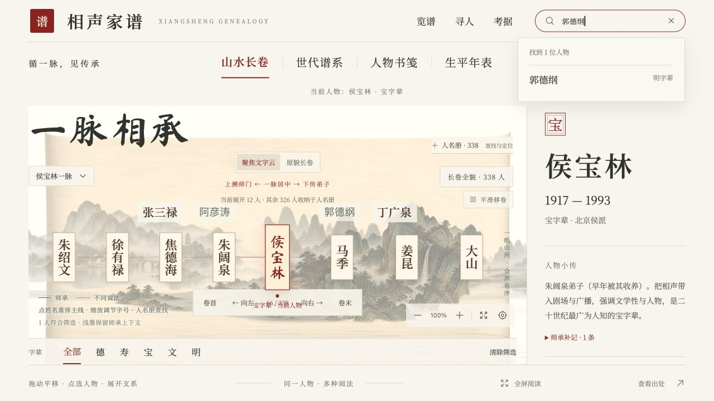
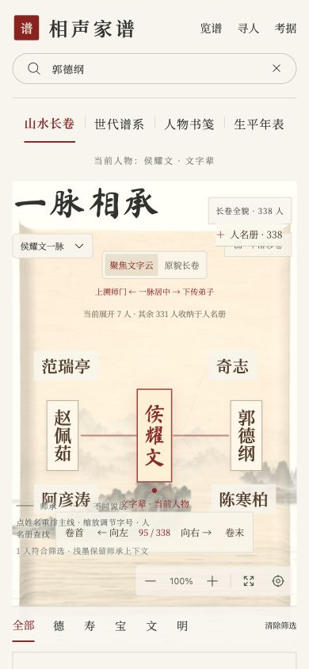
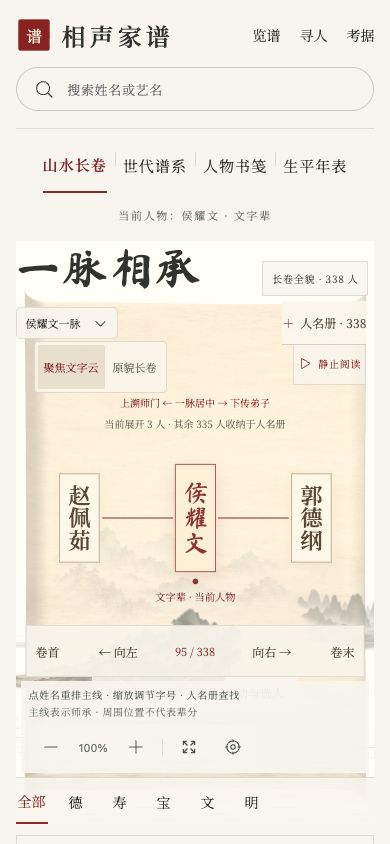
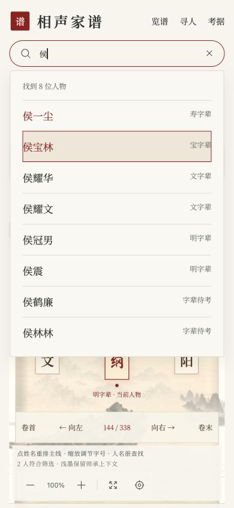
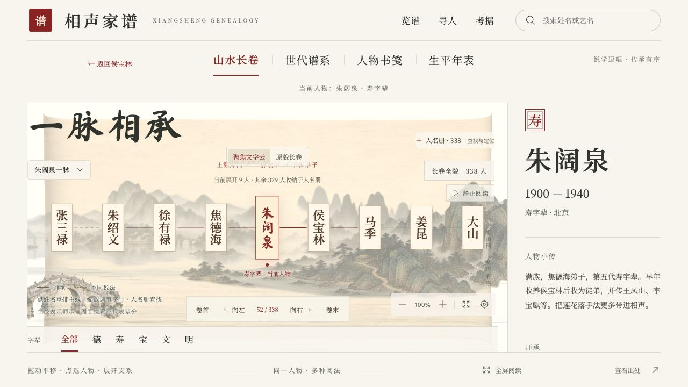
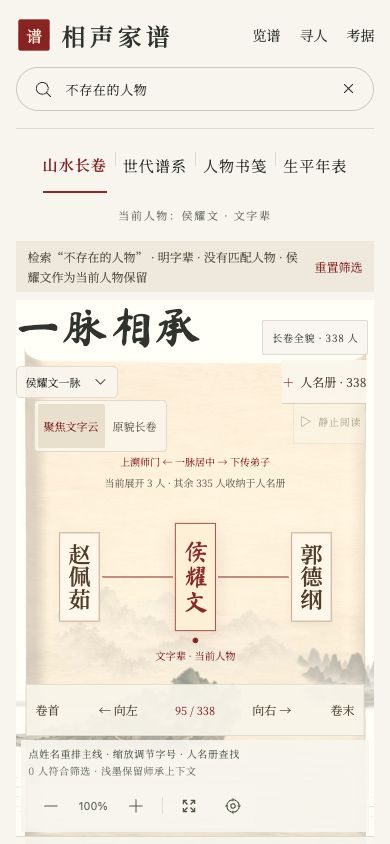

# 2026-10-03 交互审计与两批实现

本次在 Mac mini 的 Codex 内置浏览器实际运行、操作并截图。原仓库 `/Users/jammyfu/works/AI/PersonalProject/xiangsheng-genealogy` 为 main，仅有未跟踪 `.playwright-mcp/`；保留未动。实现位于独立本地副本 `/Users/jammyfu/Documents/Codex/2026-10-03/task/xiangsheng-genealogy`，分支 `ux/core-navigation-20261003`，起点 `45a3c6a`。未发布、合并、部署。

## 按严重度排序的发现与验收

|严重度|实际发现|实现与验收|
|---|---|---|
|P1|搜索郭德纲后点侯耀文，旧搜索仍约束新人物师承；当前与检索对象混淆（01、02）|选人清除完成的 query；明确字辈仍保留；筛选栏说明匹配数、空结果、当前人物保留的原因；重置一次恢复完整范围（07）|
|P1|连续上溯后无人物返回入口；跨阅法后难找来路|人物导航保存最多12步来路；返回恢复上一人物及其 URL 阅法/筛选状态；阅法切换不丢来路（05）|
|P1|390px 人物说明、移卷、操作说明重叠，缩放与字辈区域易混淆（02）|姓名布局为底部控件留空间；移卷、说明/缩放、字辈分别有区域；关键操作44px；390px body.scrollWidth=390；控件边界无交叠（06）|
|P1|关闭弹层时 inert 尚未解除，焦点恢复失败|在关闭渲染完成后恢复显式 opener；寻人自动聚焦检索框；Tab/Shift+Tab留在弹层；Escape回到寻人|
|P2|搜索仅Enter选第一人，缺少方向键结果选择|combobox/listbox、active descendant、上下键、Enter、Escape；中文输入组合期间不触发选人；失焦收起；超9结果可进入带查询的索引（04）|
|P2|切换人物沿用摘要旧滚动位置，姓名被藏住|新人物将摘要scrollTop重置到0（05）；回归测试覆盖|
|P2|重复点击当前阅法增加重复历史|同阅法不再触发navigate；点当前人物也不制造多余人物来路|

保留宣纸、水墨、朱砂、三维长卷及星空谱系方向。当前 AtlasNode 有 dimmed 且类型检查通过，历史故障不复现，没有重复修复。

## 本次流程步骤

1. 进入侯宝林长卷：视觉方向保持；等待异步场景完成后截图。基础浏览通过。
2. 搜索郭德纲/侯：结果可见；键盘选中有朱砂反馈；完成搜索清 query。通过。
3. 郭德纲→侯耀文与侯宝林→朱阔泉：选中人物/摘要更新，返回恢复来路。通过。
4. 山水长卷→世代谱系→人物书笺→返回：同一人物与来路保持。桌面/390px通过。
5. 寻人打开、检索、Tab/Shift+Tab循环、Escape关闭：初始焦点、背景inert、恢复焦点通过。
6. 字辈筛选/不存在的人物：匹配数、当前人物保留说明、空结果、重置反馈通过。
7. reduced-motion：媒体偏好模拟下“静止阅读”禁用，切换状态settled，查人与返回仍工作。通过。

## 验证记录

- 第一批提交 `6b5a2f3`：npm run lint 通过；npm test 31文件/219项通过；npm run build通过。
- 第二批最终：npm run lint（项目定义为 tsc -b）通过；npm test 31文件/220项通过；npm run build通过。日志见 tests-final.log、build-final.log。
- 构建已有大chunk警告，测试有Three.js重复实例warning；没有失败测试。
- 桌面1280×720/1280×900、窄屏390×844；搜索上下键/Enter/Escape、索引关闭/Tab循环、连续人物返回/跨视图、同阅法重复点击均已实际操作。
- 触屏注入：未运行成功。内置浏览器支持触摸模拟设置，但 Input.dispatchTouchEvent 不支持；不能把窄屏/鼠标操作视为真实触屏通过。临时触摸与reduced-motion设置已清除。
- 未做：真实iOS/Android触屏、屏幕阅读器朗读、全面对比所有师承/所有浏览器、原生全屏完整验证。

## 截图

所有截图来自本次浏览器实测，保存后已逐一查看接受。

## 下一批优先项

- P1：三维谱系窄屏仍会形成密集星点/远处标签，宜让关系名册与当前人物师父/弟子列表承担主要追溯路径，三维场景做可选空间探索；本次没有重新设计它。
- P1：真触屏设备点选、拖动误触、缩放手势与页面滚动冲突还需验证；桌面键盘和44px控件只能降低风险。
- P2：来路目前在router location.state中，刷新后会丢失（浏览器会话历史可能保留），不同入口跨会话连续阅读还需产品取舍。
- P2：选中人物/旁支的调色和缩放在三维密集场景中的区分仍需专门检查；不会仅凭截图声称全面无障碍达标。

## 启动

已通过共享端口注册表为该副本分配 HOST=127.0.0.1、PORT=4311。当前 Vite 入口 http://127.0.0.1:4311/。

依赖从原仓库本机 node_modules 复制，未修改锁文件。重启时按工作区端口规范先运行 portctl.py check，取得该目录的 worktree-frontend env，随后 npm run dev -- --host "$HOST" --port "$PORT" --strictPort。

## 第三批：可旋转的三维读树与直接师承导航

### 实测问题与优先级

- P1：全谱338人展开后，远处竖向姓名很小、纸签互相遮挡。先前简单隐藏重叠纸签无法让密集弟子分支完整可读。
- P1：原“人物与支系”平铺图中人物，不能快速区分当前人物的师父和直接弟子；展开郭德纲的95位隐藏传人是原目录检索的前置操作。
- P1：鼠标拖动与选人需要明确区分；恢复视角需要框入当前人物的直接弟子，而不是只看上溯路径。

### 实施与验收

- 横向纸签按屏幕像素定字号，随相机逐帧更新；冲突时移到附近空位，以细线连接原星点。保留当前人物红色、主线金色、对照青色/共有紫色。顶部、底部、目录、说明和相机控件均预留区域。
- 优先排布当前人物、直接弟子、师承主线和正在对照的人物；背景姓名保留最多18个上下文名签。全谱星点与师承边始终保留；图中名单、直接关系名单与全局检索提供全部人物的发现/定位路径。状态明确报告可见主线姓名数。
- “返回当前人物”框入已展开的直接弟子；“适应已展开图谱”保留全景能力。拖动超过5px后阻止节点点击选人；不用增加新的视角控制。
- 原目录改为师父/弟子/图中人物三种范围，显示总数，检索姓名、繁体名与艺名，提供明确空结果。关系直接来自目录数据，因此未展开的弟子也能找到。选择后收起，焦点回到summary；Escape在整个目录中生效。
- 验收：郭德纲密集分支在正面、侧转、俯视、反向及放大/缩小视角，主线可见姓名不应被容量策略丢弃；拖动中间帧姓名无相互遮挡、细线可追到星点；旋转不得改变当前人物URL；点击返回应恢复人物分支。通过截图、状态计数及URL断言验证。

### 浏览器记录

本轮内置CUA工具未暴露，使用本机现有Playwright及独立Chrome/Metal GPU会话。1440×1000桌面、390×844窄屏。独立会话不复用用户Chrome资料。

- 正面、侧转、俯视、缩小：108/108可见主线姓名；反向81/81；放大10/10（放大裁切视窗后统计视窗内人物）。拖动中间帧也保存截图。视窗外当前人物仍优先保留名签。
- 三次连续拖动都未改变人物URL；滚轮缩放、恢复当前分支通过。页面运行错误为空。
- 郭德纲→弟子范围检索“岳”→Enter选择岳云鹏→人物书笺→返回郭德纲及原谱系，通过。
- reduced-motion媒体模拟下，从目录范围按钮按Escape收起并恢复SUMMARY焦点；恢复no-preference后关闭独立浏览器。窄屏无横向溢出。
- 真实iOS/Android触屏、读屏、原生全屏未运行。旧CUA会话的模拟设置本轮无法访问，不能确认旧会话设置已复位；本轮独立会话设置已复位并关闭。
- 物理屏幕容量有限，不能同时排列全库338个姓名。采用主线优先和背景上下文上限，全部人物仍保留星点和检索入口；在更小窗口或特别长姓名下可能需缩放、旋转或目录定位。没有把任意连续角度、所有硬件都声明为通过。

### 证据

- `10-before-tree-mobile.jpg`、`09-before-tree-full.jpg`：改前密集纸签。
- `14-rotation-front.png`、`15-rotation-side.png`、`15-rotation-tilt.png`、`15-rotation-reverse.png`：最终多角度。
- `18-mid-drag-side.png`、`18-mid-drag-tilt.png`、`18-mid-drag-reverse.png`：鼠标仍按下时的中间帧。
- `16-rotation-zoom.png`、`19-rotation-zoom-out.png`：两种缩放；`17-tree-mobile-final.png`：最终窄屏。
- `rotation-verification.json`：最后一轮状态计数、错误、焦点及URL断言；`browser-third.log`：浏览器运行日志。

初次同时运行软件渲染和完整测试出现负载超时，软件渲染会话已关闭。最终测试使用2个worker、20秒测试超时，保留全部原有断言，未修改全局测试配置。最终结果见tests-third.log、lint-final.log、build-third.log。项目lint脚本为TypeScript检查；构建大chunk及Three重复实例warning仍保留。

最终完整检查：npm run lint通过；npm test -- --maxWorkers=2 --testTimeout=20000：32文件/222项通过；npm run build通过。git diff --check通过。
